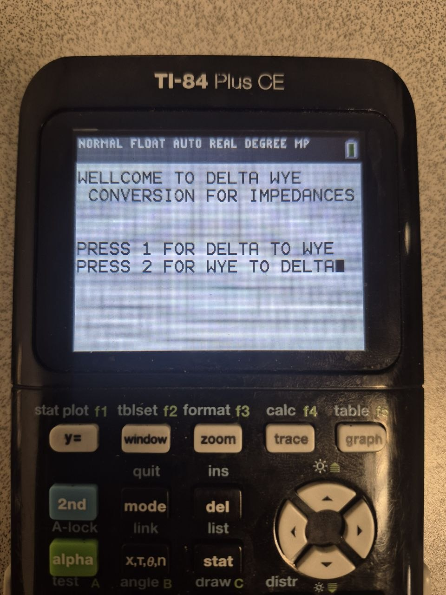
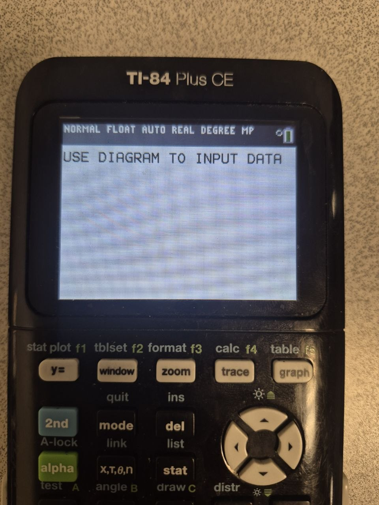
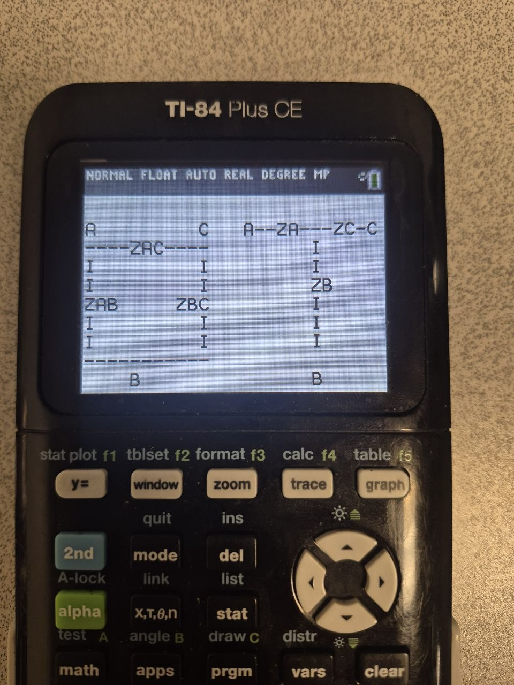

## Table of Contents

- [Summary](#summary)
- [Overview of Tools](#overview-of-tools)
    - [Parallel Impedance Solver](#parralel-impedance-solver)
    - [Wye-Delta Conversion Tool](#wye-delta-conversion-tool)
    - [Phasor-Calculation Engine](#phasor-calculation-engine)

# Summary

A suite of custom-built applications for the TI-84 calculator designed to streamline common circuit analysis tasks. These tools reduce repetitive computation, minimize human error, and accelerate problem-solving in steady-state and network analysis.

## Overview of Tools
This project includes multiple calculator-based applications that automate key operations frequently encountered in circuit analysis:

### Parallel Impedance Solver
Computes equivalent impedance for arbitrary components in parallel, supporting complex values.
### Wye–Delta Conversion Tool
Quickly converts between Wye (Y) and Delta (Δ) configurations, eliminating tedious algebra. Before inputting any values, the application displays an orientation diagram to help the user map the current circuit to the transformation. Below are steps to use the application

1.) Click on PRGRM on your TI-84.  

2.) You should see the Home Screen.  

 

3.) The application will notify you of an incoming diagram to help you orient and convert your values to be used in the program:    

   

4.) The application will display the aformentioned diagram :    
   

5.) Input your values.

6.)Redraw your converted circuit with the new values.

### Phasor Calculation Engine 
Performs arithmetic on phasors in both:

Rectangular form (a + jb)
Polar form (magnitude ∠ angle)

Designed to simplify steady-state sinusoidal analysis, including addition, subtraction, multiplication, and division.
