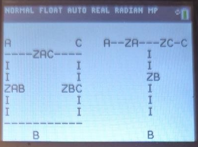

# Summary

A suite of custom-built applications for the TI-84 calculator designed to streamline common circuit analysis tasks. These tools reduce repetitive computation, minimize human error, and accelerate problem-solving in steady-state and network analysis.

## Overview of Tools
This project includes multiple calculator-based applications that automate key operations frequently encountered in circuit analysis:

### Parallel Impedance Solver
Computes equivalent impedance for arbitrary components in parallel, supporting complex values.
### Wye–Delta Conversion Tool
Quickly converts between Wye (Y) and Delta (Δ) configurations, eliminating tedious algebra. Before inputting any values, displays a orientation diagram to help the user map the current circuit to the transformation (shown below) 

### Phasor Calculation Engine 
Performs arithmetic on phasors in both:

Rectangular form (a + jb)
Polar form (magnitude ∠ angle)

Designed to simplify steady-state sinusoidal analysis, including addition, subtraction, multiplication, and division.
